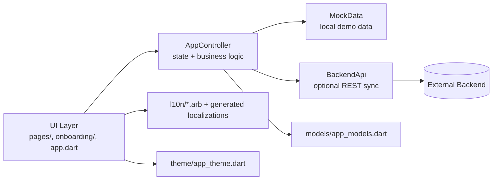
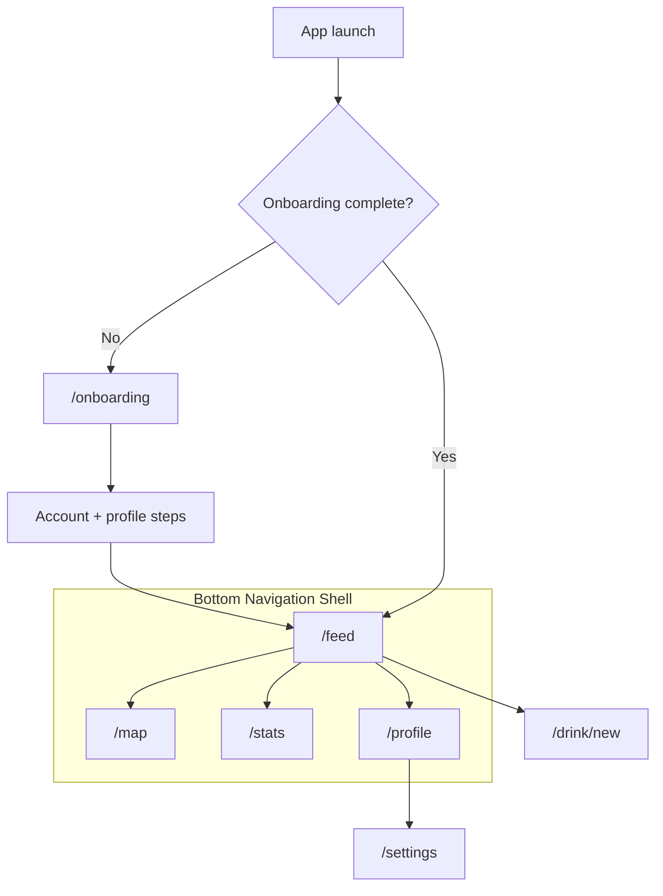

# GlassTrail

GlassTrail is a mobile-first Flutter app for logging drinks (non-alcoholic and alcoholic), tracking trends over time, and sharing activity with friends.

The app runs with local mock data by default and can optionally sync with a REST backend using Dart define flags.

## What the project is about

- Personal drink tracking with fast logging.
- Social timeline with cheers, comments, and badge events.
- Map-based context for your and your friends' drink logs.
- Statistics for daily/weekly/monthly totals, category splits, and streaks.
- Onboarding flow with optional invite token support.
- Legacy data import for BeeerWithMe JSON exports.

## Core features

- Feed (`/feed`)
  - Timeline of drink logs and bundled badge unlock events.
  - Pull-to-refresh plus cheer/comment interactions.
- Map (`/map`)
  - OpenStreetMap-based map with filters (mine/friends/category/date).
  - Marker details in a draggable bottom sheet.
- Add Drink (`/drink/new`)
  - 4-step flow: drink selection, optional photo/comment, friend tags, confirm.
- Statistics (`/stats`)
  - Overview charts (line/pie/bar), stats map, grouped history list.
- Profile + Settings (`/profile`, `/settings`)
  - Badges, friend management, notifications, theme/language, data import.

## Architecture



## Navigation flow



## Project structure

```text
lib/
  main.dart                    # App entrypoint
  app.dart                     # MaterialApp.router + route setup
  api/backend_api.dart         # REST client + payload parsing
  state/app_controller.dart    # State, sync flows, stats, import logic
  models/app_models.dart       # Domain models and enums
  data/mock_data.dart          # In-memory mock dataset
  pages/                       # Feed, Map, Add Drink, Stats, Profile, Settings, Shell
  onboarding/                  # First-run onboarding flow
  l10n/                        # ARB files + generated localizations
  theme/                       # Light/dark Material 3 theme
test/
  widget_test.dart             # Onboarding smoke test
```

## Getting up and running

### 1) Prerequisites

- Flutter SDK with Dart `>=3.4.0 <4.0.0`
- A configured device/emulator/browser (`flutter devices`)
- Platform SDKs/toolchains (`flutter doctor`)

### 2) Install dependencies

```bash
flutter pub get
```

### 3) Run locally (mock mode, default)

```bash
flutter run -d chrome
```

Notes:
- First launch opens onboarding. Complete it to access the app shell.
- Without API flags, all data is local/mock.

### 4) Run with backend API (optional)

```bash
flutter run -d chrome \
  --dart-define=USE_REMOTE_API=true \
  --dart-define=API_BASE_URL=http://localhost:3000
```

Optional invite token for onboarding/register:

```bash
--dart-define=INVITE_TOKEN=<token>
```

Configuration flags:

| Flag | Default | Purpose |
| --- | --- | --- |
| `USE_REMOTE_API` | `false` | Enables backend synchronization |
| `API_BASE_URL` | `http://localhost:3000` | Backend base URL |
| `INVITE_TOKEN` | empty | Optional invite token for registration |

### 5) Verify

```bash
flutter analyze
flutter test
```

## Wired backend endpoints

- `POST /v1/auth/register`
- `POST /v1/auth/login`
- `GET /v1/feed`
- `POST /v1/drinks/log`
- `POST /v1/posts/{postId}/cheers`
- `POST /v1/posts/{postId}/comments`
- `GET /v1/friends`
- `POST /v1/friends/requests`
- `POST /v1/friends/requests/{id}/accept`
- `POST /v1/friends/requests/{id}/reject`
- `DELETE /v1/friends/{id}`
- `PATCH /v1/notifications/preferences`
- `POST /v1/devices/register`

## Legacy import

From Settings, use **Pick JSON file** to validate and import BeeerWithMe data.

The import dialog includes:
- total entries
- valid entries
- validation errors
- legacy glass type mapping preview
