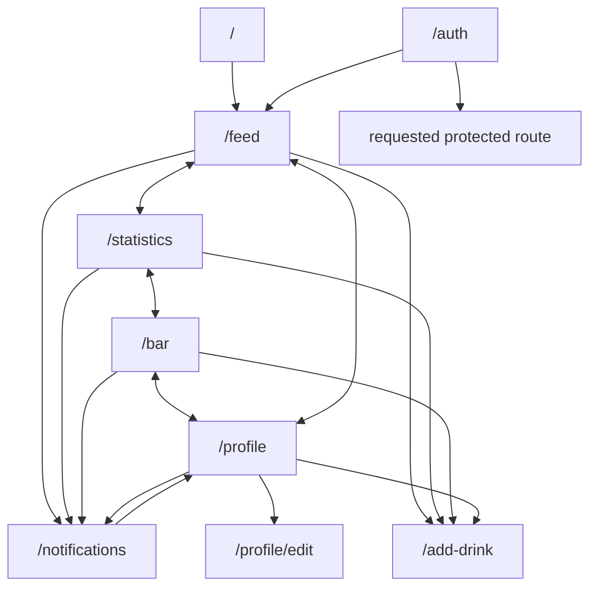
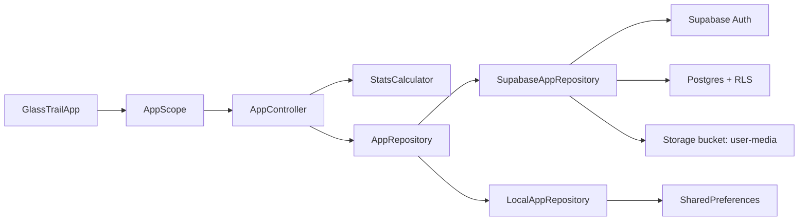
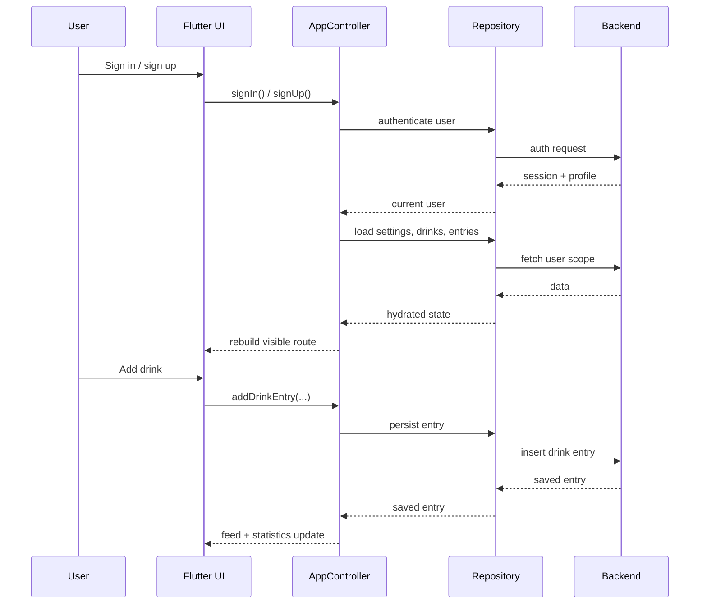
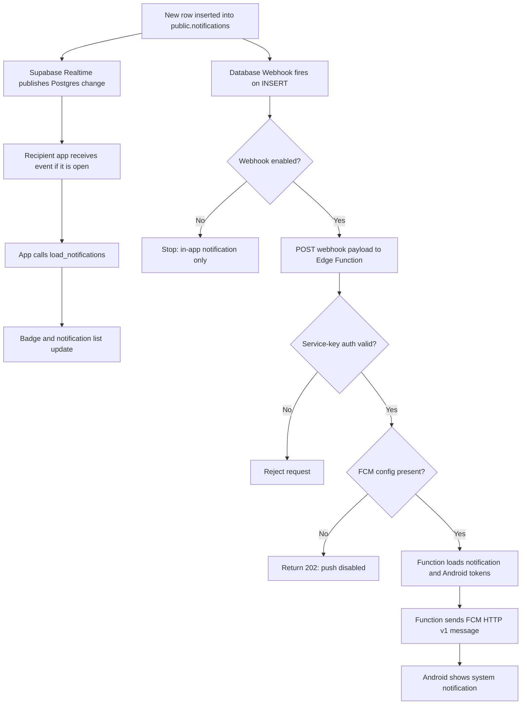

# GlassTrail

[](https://github.com/donjoergo/glasstrail/actions/workflows/android-release.yml)
[](https://github.com/donjoergo/glasstrail/actions/workflows/ci.yml)
[](https://crowdin.com/project/glasstrail)

[Web App](https://glasstrail.vercel.app/) | [Android App](https://github.com/donjoergo/glasstrail/releases)

GlassTrail is a Flutter app for tracking drinks, reviewing personal habits in statistics, following friends in a shared feed, and staying on top of social activity with notifications. The initial idea was to make a worthy successor to [Beer With Me](https://play.google.com/store/apps/details?id=se.dagsappar.beer&hl=de) with modern design and a few extra perks.

## Features

- Intuitive drink logging with photo, location and comment
- Personal feed for your own drink history
- Friends feature with shareable profile links, incoming requests, and private friend connections
- Social feed with friends' drink entries, comments, photos, and locations
- In-app and Android push notifications for friend requests, friendship updates, and new drinks from friends
- Statistics with streaks, category breakdown, map, and gallery
- Global drink catalog plus user-defined custom drinks
- Bar management with drink sorting, visibility controls, and custom drinks
- Email/password sign-up and sign-in (as usual)
- Personal profile with display name, profile photo and birthday
- Left-handed mode
- Multi device support: See your drinks, statistics, and profile on multiple devices
- Multi platform support: Android and Web
- Multi language support: English and German

## Tech Stack and Tooling

| Area               | Tooling                                        | Role                                                                                         |
| ------------------ | ---------------------------------------------- | -------------------------------------------------------------------------------------------- |
| App framework      | Flutter, Dart                                  | Shared Android and Web app code, generated localization output, and the widget test harness  |
| Backend            | Supabase                                       | Auth, Postgres with RLS, Storage, Edge Functions, SQL migrations, and seed data              |
| Push notifications | Firebase Cloud Messaging                       | Android push delivery for notification events; server-side credentials stay outside the repo |
| Web hosting        | Vercel                                         | Production/test web deployments and the friend profile preview Serverless Function           |
| Localization       | Flutter gen-l10n, Crowdin                      | ARB source files in `lib/l10n/`, Crowdin translation sync, and generated Dart localizations  |
| Quality checks     | flutter_lints, Flutter analyze/test, SonarQube | Lints, static analysis, tests, coverage, and the Sonar scan configured in CI                 |
| Release notes      | cider                                          | Changelog entries, release sections, and GitHub tag/diff links                               |
| CI/CD              | GitHub Actions                                 | Formatting, analysis, tests, web builds, Sonar scans, and Android release APK publishing     |
| Maps and media     | MapLibre, Image Picker, Geolocator             | Statistics maps, entry/profile media, and optional location capture                          |
| Local fallback     | SharedPreferences                              | Local repository storage when Supabase configuration is unavailable                          |
| App assets         | flutter_launcher_icons, flutter_native_splash  | Launcher icon and splash screen generation from checked-in configuration                     |

## App Pages

The app exposes one route per visible page. On Flutter Web, in-app routing currently uses hash URLs, so bookmarks look like `/#/feed`. Public friend profile shares use non-hash URLs so messengers can render link previews.

| Page           | Route                     | Purpose                                                                  |
| -------------- | ------------------------- | ------------------------------------------------------------------------ |
| Auth           | `/auth`                   | Sign in and sign up                                                      |
| Feed           | `/feed`                   | Personal and social drink feed                                           |
| Statistics     | `/statistics`             | Trends, streaks, and category breakdown                                  |
| Bar            | `/bar`                    | Organize the drink catalog and manage custom drinks                      |
| Profile        | `/profile`                | Profile summary and app settings                                         |
| Notifications  | `/notifications`          | In-app alerts for friend requests, drink updates, and friendship changes |
| Edit Profile   | `/profile/edit`           | Dedicated profile editing page                                           |
| Friend Profile | `/friends/profile/<code>` | In-app friend profile route for sending requests                         |
| Add Drink      | `/add-drink`              | Log a drink from recent, global, or custom options                       |

Additional routing behavior:

- `/` redirects to `/feed`
- Protected routes show the auth flow when the user is signed out
- After successful authentication, the app returns to the originally requested protected route
- Public friend profile links use `https://glasstrail.vercel.app/friends/profile/<code>` for previews
- In-app friend profile links use `https://glasstrail.vercel.app/#/friends/profile/<code>` for Flutter routing
- Friend profile links are reusable; signed-out viewers see a public invitation with a sign-in CTA
- On Flutter Web, a full browser reload restores the last visited page
- After an explicit logout, the next login lands on `/feed`

## Navigation Map



## App Architecture

The UI is driven by `GlassTrailApp`, coordinated by `AppController`, and backed by an `AppRepository` implementation chosen at bootstrap time.



## Main User Flows



## Development

Install dependencies:

```bash
flutter pub get
```

Run the app:

```bash
flutter run
```

### Flutter Environment Variables

Override flutter environment variables if needed:

| Variable            | Purpose                              |
| ------------------- | ------------------------------------ |
| SUPABASE_URL        | Supabase URL                         |
| SUPABASE_ANON_KEY   | Supabase anon key                    |
| FORCE_UPDATE_NOTICE | Force update/changlog notice in feed |

Example:

```bash
flutter run \
  --dart-define=SUPABASE_URL=https://YOUR_PROJECT.supabase.co \
  --dart-define=SUPABASE_ANON_KEY=YOUR_PUBLISHABLE_KEY \
  --dart-define=FORCE_UPDATE_NOTICE=true
```

### Push Notifications

GlassTrail keeps users informed about social activity with an in-app notification inbox. Friend requests, accepted or removed friendships, and newly logged drinks from friends show up there. On Android, the same events can also arrive as push notifications via Firebase Cloud Messaging (FCM) while the app is in the background.

#### Notification Flow



#### Configure FCM

To configure FCM, proceed as follows:

##### Create Firebase Project

1. Create or open a Firebase project.
2. Add an Android app in Firebase with package name `dev.glasstrail.glasstrail`.
3. Set up Firebase CLI and flutterfire according to [this guide](https://firebase.google.com/docs/flutter/setup?hl=de&platform=android).
4. Generate the FlutterFire options for Android:

```bash
flutterfire configure
```

##### Configure Supabase Secrets

Create the Firebase service account JSON in `Firebase Project settings > Service accounts > Generate new private key`. A JSON file gets downloaded. Store it outside the repository and never commit it. Configure the FCM function secret with the downloaded Firebase service account JSON:

```bash
supabase secrets set FCM_SERVICE_ACCOUNT_JSON='{"type":"service_account",...}'
```

##### Create Supabase Webhook

Create a Supabase Database Webhook that calls the Edge Function when a notification row is inserted:

1. Open Supabase Dashboard > Database > Webhooks.
2. Create a new hook.
3. Set the table to `public.notifications`.
4. Enable only the `Insert` event.
5. Use webhook type `Supabase Edge Functions`.
6. Select the `send-notification-push` Edge Function.
7. Keep method `POST` and timeout `1000`.
8. In HTTP headers, add the auth header with the service role key, not the anon key, and keep `Content-Type: application/json`.
9. Create the webhook.

#### Notification Images

Notification rows store display art in `notifications.image_path`. User-uploaded media keeps using `user-media` storage paths, which the push Edge Function signs before sending to FCM. Static notification art that should not be bundled into the Flutter app lives under `web/notification-assets/` and is referenced with absolute HTTPS URLs such as `https://glasstrail.vercel.app/notification-assets/cheers.png`. Absolute HTTPS URLs are passed through for push notifications and rendered directly by the app.

### Public Friend Profile Previews

Messenger link previews are served by the Vercel Serverless Function in `api/friend-profile-preview.js`, because Supabase Edge Functions rewrite `text/html` responses to `text/plain` for `GET` requests. The production Vercel rewrite in `vercel.json` maps `https://glasstrail.vercel.app/friends/profile/<code>` to that Vercel Function while keeping the Glass Trail URL visible.

The Supabase Edge Function in `supabase/functions/friend-profile-preview` serves public preview JSON and redirects profile image requests. The Flutter app and the Vercel Function both use that JSON endpoint.

Configure these Supabase function secrets before deployment:

| Secret                      | Purpose                                                                                                      |
| --------------------------- | ------------------------------------------------------------------------------------------------------------ |
| SUPABASE_URL                | Supabase project URL                                                                                         |
| SUPABASE_SERVICE_ROLE_KEY   | Server-only key for reading limited profile preview data and signing profile images                          |
| FRIEND_PROFILE_APP_ICON_URL | Optional absolute fallback preview image URL, defaults to `https://glasstrail.vercel.app/icons/Icon-512.png` |

The Supabase function is configured as public in `supabase/config.toml`:

```bash
npx supabase functions deploy friend-profile-preview
```

Configure these Vercel environment variables if the defaults are not correct:

| Variable                     | Purpose                                                                                          |
| ---------------------------- | ------------------------------------------------------------------------------------------------ |
| FRIEND_PROFILE_DATA_BASE_URL | Supabase preview data endpoint, defaults to the production `friend-profile-preview` function URL |

### Verification

Static analysis:

```bash
flutter analyze
```

Format all files:

```bash
dart format .
```

Unit and widget tests:

```bash
flutter test
```

Integration tests:

```bash
flutter test integration_test
```

### Changelog

Use [cider](https://pub.dev/packages/cider) to create a changelog.

Examples:

```bash
cider log added "new feature"
```

or 

```bash
cider log fixed "a bug"
```

## Deployment and releases

### Creating a Release

1. Update `pubspec.yaml` with the app version you want to ship.
2. Update the changelog with the command `cider release`
3. Commit and push that change to `main`.
4. Create and push a tag such as `1.0.0`.
5. Merge `main` into `release` branch

```bash
git tag 1.0.0
git push origin 1.0.0
```

When the tag reaches GitHub, the workflow builds `app-release.apk` and attaches it to the matching release as `glasstrail-v1.0.0.apk`.

### Vercel

GlassTrail is connected to Vercel for web deployment.

`release` branch is CD deployed to [glasstrail.vercel.app](https://glasstrail.vercel.app/).

`main` branch is CD deployed to [glasstrailtest.vercel.app](https://glasstrailtest.vercel.app/).

### Android Releases

On every newly created tag, a CD workflow builds an APK and creates a release on GitHub.

#### Keystore

The workflow expects a real Android release keystore. `android/app/build.gradle.kts` reads `android/key.properties` when it exists and uses that release signing config. If the file is absent, local release builds still fall back to the debug key.

Create an upload keystore locally:

```bash
keytool -genkeypair \
  -v \
  -keystore upload-keystore.jks \
  -alias upload \
  -keyalg RSA \
  -keysize 2048 \
  -validity 10000
```

Base64-encode it for GitHub Actions:

```bash
base64 -w 0 upload-keystore.jks
```

Add these repository secrets in GitHub:

- `ANDROID_KEYSTORE_BASE64`
- `ANDROID_KEYSTORE_PASSWORD`
- `ANDROID_KEY_ALIAS`
- `ANDROID_KEY_PASSWORD`
