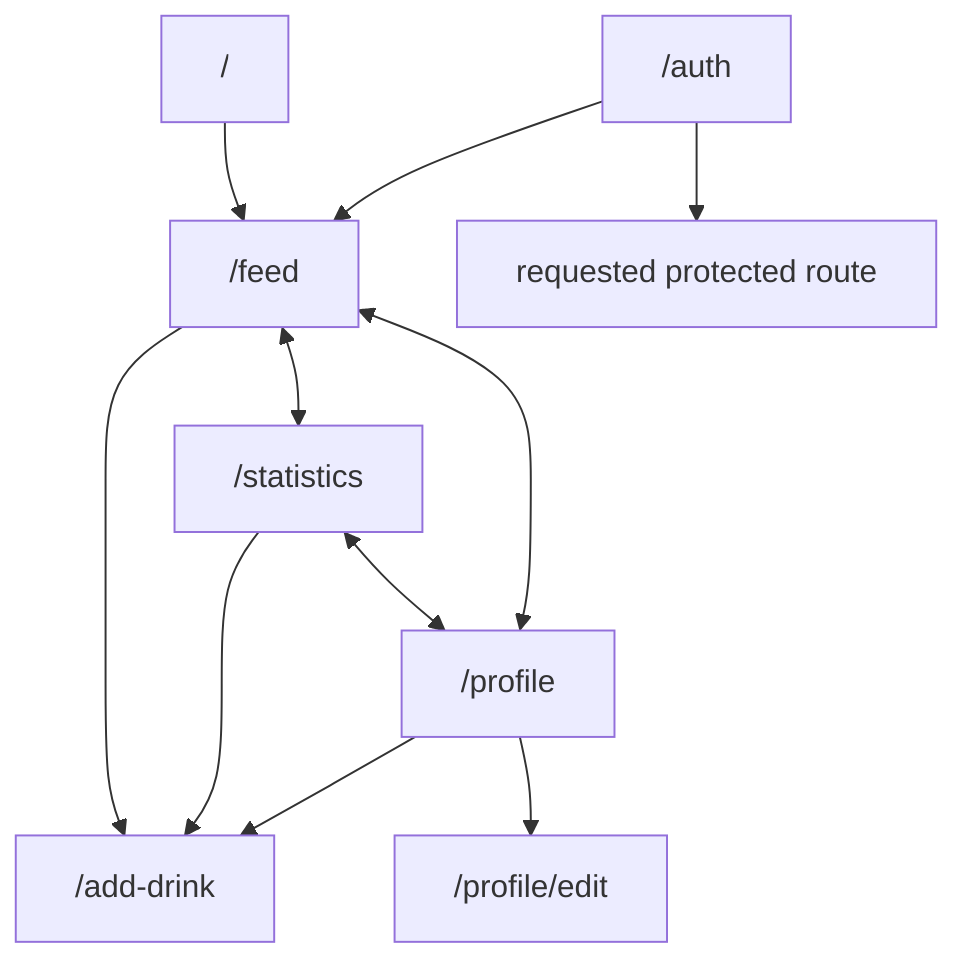
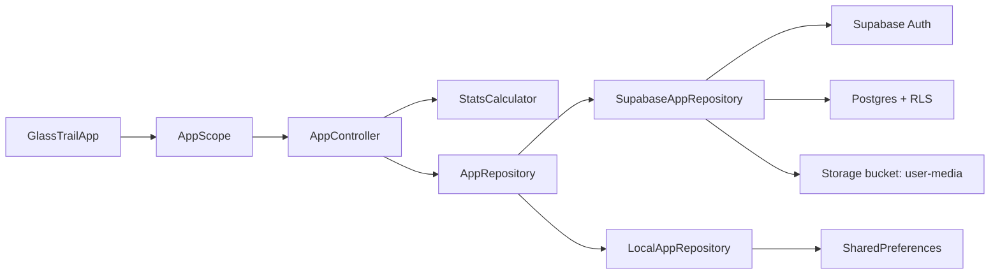
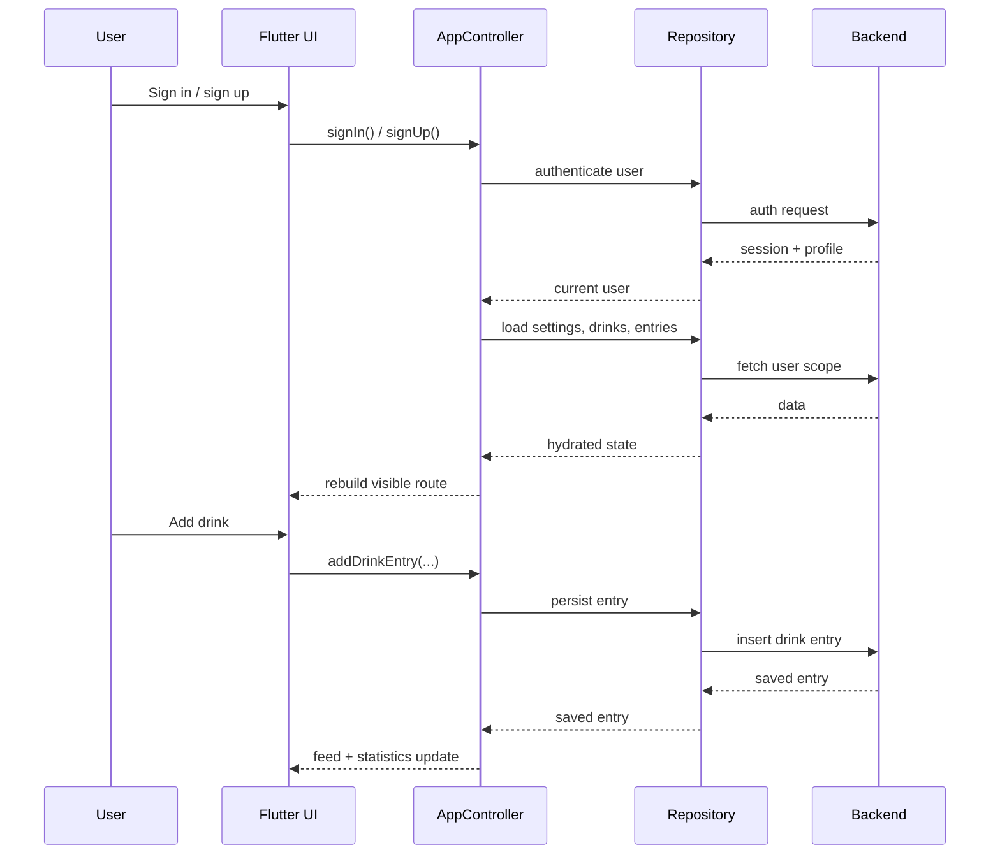

# GlassTrail

GlassTrail is a Flutter app for tracking drinks, reviewing personal habits, and keeping profile and app settings in sync across devices.

By default, this repository uses the hosted Supabase project configured in `lib/src/backend_config.dart`. For tests and explicit bootstrap overrides, the app can still run against a local `SharedPreferences` fallback.

## Features

- Email/password sign-up and sign-in
- Personal profile with display name, optional birthday, and optional profile photo
- Birthday handling with day and month only
- Global drink catalog plus user-defined custom drinks
- Drink logging with optional comment and optional photo
- Feed/history view for past entries
- Statistics with streaks, time ranges, and category breakdown
- Persisted theme, language, unit, and handedness settings
- Left-handed and right-handed FAB placement
- English and German UI
- Bookmarkable routes for every visible app page

## App Pages

The app exposes one route per visible page. On Flutter Web, routing currently uses hash URLs, so bookmarks look like `/#/feed`.

| Page | Route | Purpose |
| --- | --- | --- |
| Auth | `/auth` | Sign in and sign up |
| Feed | `/feed` | Main history/feed view |
| Statistics | `/statistics` | Trends, streaks, and category breakdown |
| Profile | `/profile` | Profile summary and app settings |
| Edit Profile | `/profile/edit` | Dedicated profile editing page |
| Add Drink | `/add-drink` | Log a drink from recent, global, or custom options |

Additional routing behavior:

- `/` redirects to `/feed`
- Protected routes show the auth flow when the user is signed out
- After successful authentication, the app returns to the originally requested protected route
- After an explicit logout, the next login lands on `/feed`

## Navigation Map



## App Architecture

The UI is driven by `GlassTrailApp`, coordinated by `AppController`, and backed by an `AppRepository` implementation chosen at bootstrap time.



## Main User Flows



## Backend Modes

### Supabase

Default production runs use:

- `supabase_flutter` for app bootstrap and auth session persistence
- Postgres tables for profiles, settings, custom drinks, and drink entries
- Row-level security so users only access their own data
- Supabase Storage bucket `user-media` for uploaded profile and drink images

Relevant code:

- `lib/src/repository/supabase_app_repository.dart`
- `lib/src/backend_config.dart`

Schema migrations:

- `supabase/migrations/202603180001_initial_schema.sql`
- `supabase/migrations/202603180002_optimize_policies.sql`
- `supabase/migrations/202603180003_add_handedness_to_user_settings.sql`
- `supabase/migrations/202603180004_drop_nickname_from_profiles.sql`

### Local Fallback

Tests and explicit empty backend configs use:

- `lib/src/repository/local_app_repository.dart`

This keeps the app runnable without Supabase and makes widget and repository tests deterministic.

## Project Structure

| Path | Purpose |
| --- | --- |
| `lib/main.dart` | Bootstrap entry point |
| `lib/src/app.dart` | Top-level app and route handling |
| `lib/src/app_routes.dart` | Named routes and tab-route mapping |
| `lib/src/app_controller.dart` | State orchestration and user actions |
| `lib/src/models.dart` | Domain models and formatting helpers |
| `lib/src/screens/` | UI pages and dialogs |
| `lib/src/repository/` | Backend abstraction and implementations |
| `supabase/migrations/` | Database schema and policy migrations |
| `test/` | Unit, widget, and repository tests |

## Local Development

Install dependencies:

```bash
flutter pub get
```

Run the app:

```bash
flutter run
```

Override Supabase configuration if needed:

```bash
flutter run \
  --dart-define=SUPABASE_URL=https://YOUR_PROJECT.supabase.co \
  --dart-define=SUPABASE_ANON_KEY=YOUR_PUBLISHABLE_KEY
```

## Verification

Static analysis:

```bash
flutter analyze
```

Unit and widget tests:

```bash
flutter test
```

Integration tests:

```bash
flutter test integration_test
```
